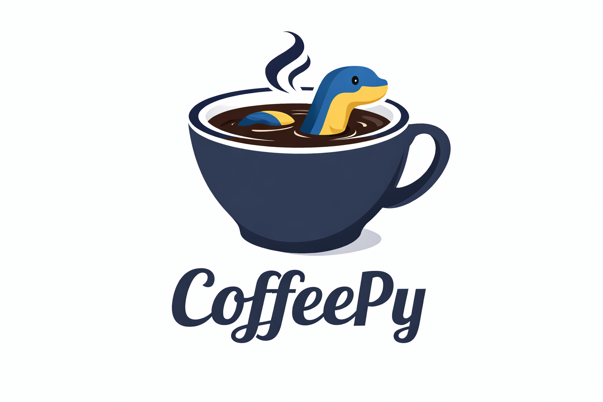

<div align="center">



**CoffeeScript that runs on Python**

Write CoffeeScript syntax • Execute with Python runtime • Use the entire Python ecosystem

[](https://github.com/AndersonFirmino/coffeepy)
[](https://www.python.org/)
[](LICENSE)

</div>

---

## Why CoffeePy?

| CoffeeScript | Python | CoffeePy |
|:------------:|:------:|:--------:|
| ✍️ Beautiful syntax | 🐍 Powerful ecosystem | ✅ Best of both |
| → JavaScript | → Python runtime | → Python runtime |
| Limited libs | Huge libs | Full Python libs |

**No JavaScript. No Node.js. Just Python with CoffeeScript syntax.**

---

## 📦 Installation

```bash
# From PyPI (coming soon)
pip install coffeepy

# From source
git clone https://github.com/AndersonFirmino/coffeepy.git
cd coffeepy
pip install -e .
```

---

## 🚀 Quick Start

### Run a File

```bash
python -m coffeepy script.coffee
```

### Interactive REPL

```bash
python -m coffeepy -i
```

```
coffee> x = 10
10
coffee> x * 2
20
coffee> .exit
Bye!
```

### Evaluate Expression

```bash
python -m coffeepy --eval "print 'Hello, World!'"
```

---

## 📖 Documentation

| Guide | Description |
|-------|-------------|
| [Language Guide](docs/LANGUAGE_GUIDE.md) | Complete syntax reference |
| [Examples](examples/) | Code examples from basic to advanced |
| [Python Interop](docs/PYTHON_INTEROP.md) | Using Python libraries |
| [API Reference](docs/API.md) | CLI and module API |

---

## ✨ Features at a Glance

### Python Imports

```coffee
from os import getcwd, getenv
from datetime import datetime
import json

print "Current dir: #{getcwd()}"
print "Time: #{datetime.now()}"
```

### Functions

```coffee
# Arrow functions
add = (a, b) -> a + b
greet = (name = "World") -> "Hello, #{name}!"

# Fat arrow (auto-bind)
class Button
  constructor: (@label) ->
    this.onClick = => print @label
```

### Classes

```coffee
class Animal
  constructor: (@name) ->
  speak: -> "#{@name} says hi"

class Dog extends Animal
  speak: -> "#{@name} barks!"

dog = new Dog "Rex"
dog.speak()  # "Rex barks!"
```

### Destructuring

```coffee
[a, b, rest...] = [1, 2, 3, 4, 5]    # a=1, b=2, rest=[3,4,5]
{name, age} = {name: "John", age: 30} # name="John", age=30
{x, y = 10} = {x: 5}                  # x=5, y=10
```

### Comprehensions

```coffee
doubled = [x * 2 for x in [1, 2, 3]]        # [2, 4, 6]
evens = [x for x in [1..10] when x % 2 == 0] # [2, 4, 6, 8, 10]
pairs = {x: x*2 for x in [1, 2, 3]}         # {1: 2, 2: 4, 3: 6}
```

### Operators

```coffee
# Existential
name = user?.name ? "Anonymous"
value ?= "default"

# Logical assignment  
a ||= b    # a = a || b
a &&= b    # a = a && b

# Comparison
x is y     # x == y
x isnt y   # x != y
1 < x < 10 # chained

# Ranges
[1..5]       # [1, 2, 3, 4, 5]
[1...5]      # [1, 2, 3, 4]
[1..10 by 2] # [1, 3, 5, 7, 9]
[10..1]      # [10, 9, 8, 7, 6, 5, 4, 3, 2, 1]
```

---

## 🎯 Feature Matrix

| Category | Features |
|:--------:|:---------|
| **Core** | Variables, scoping, arithmetic, comparison, logical operators, assignments |
| **Functions** | Arrow `->`, fat arrow `=>`, default params, rest params `...`, closures |
| **Classes** | `class`, `extends`, `super`, `new`, `constructor`, `::` prototype access |
| **Control** | `if/then/else`, `unless`, `switch/when/else`, `while`, `until`, `for in`, `for of` |
| **Data** | Arrays, objects, destructuring, splats, comprehensions |
| **Operators** | `?`, `?.`, `?=`, `||=`, `&&=`, `is`, `isnt`, `in`, `of`, ranges, slices |
| **Strings** | `"#{interpolation}"`, `"""block strings"""`, `///heregex///`, `/regex/flags` |
| **Python** | `import`, `from ... import`, `import * as`, full library access |

---

## 🧪 Running Tests

```bash
python -m coffeepy.tests
```

```
Ran 177 tests in 0.070s
OK
```

---

## 📁 Project Structure

```
coffe-py/
├── coffeepy/
│   ├── __main__.py    # CLI entry point
│   ├── lexer.py       # Tokenizer
│   ├── parser.py      # Parser
│   ├── ast_nodes.py   # AST definitions
│   ├── interpreter.py # Runtime
│   └── tests/         # Test suite
├── docs/              # Documentation
├── examples/          # Code examples
│   ├── basic/         # Getting started
│   ├── intermediate/  # Common patterns
│   ├── advanced/      # Complex features
│   └── python-interop/ # Python integration
└── README.md
```

---

## 🤝 Contributing

Contributions are welcome! Please:

1. Fork the repository
2. Create a feature branch
3. Add tests for new features
4. Submit a pull request

---

## 📜 License

MIT License - see [LICENSE](LICENSE) for details.

---

<div align="center">

**Made with ☕ and 🐍**

[Documentation](docs/) • [Examples](examples/) • [Issues](https://github.com/AndersonFirmino/coffeepy/issues)

</div>
